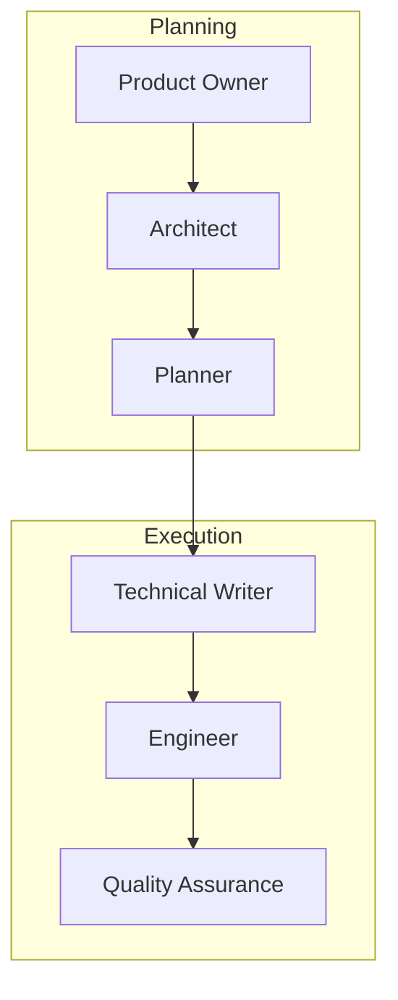

# Agent workflow

Forge orchestrates work through six phases. Each phase has a primary agent (and sometimes subagents) with clear responsibilities.

## Flow overview

**Planning:** Vision → Architecture → Roadmap  
**Execution:** Refine tickets → Implement (with tests) → Review

---

## Phase 1: Product Owner

**When:** You provide product intake, strategy, or market input (often ahead of or with `/architect-this`).

**What it does:** Maintains product direction. Reads `vision.json` and `project.json`, decides whether vision or project metadata needs updates, and hands off to the Architect when technical alignment is required.

**Owns:** `.forge/vision.json`, `.forge/project.json` (with your review)

---

## Phase 2: Architect

**Command:** `/architect-this {your prompt}`

**What it does:** High-level design. Loads the vision, runs a clarity check, invokes the right **domain SME** subagents to update contracts, then hands a recap to the Planner.

**Owns:** `knowledge_map.json` structure; delegates content to domain folders.

### Domain subagents (invoked by Architect)

| Subagent | Scope |
|----------|-------|
| **Runtime** | Configuration, startup, lifecycle, execution |
| **Business logic** | Domain model, user stories, errors |
| **Data** | Model, persistence, consistency |
| **Interface** | Input, presentation, interaction |
| **Integration** | APIs, external systems, messaging |
| **Operations** | Build, deploy, observability, security |

Each owns `.forge/<domain>/` and updates it when the Architect delegates.

---

## Phase 3: Planner

**Command:** `/plan-roadmap`

**What it does:** Aligns GitHub milestones and issues with the vision and knowledge map. Pulls milestones and issues from GitHub, then creates or updates them. GitHub is the source of truth.

**Owns:** Milestones, issue titles/bodies at the roadmap level

---

## Phase 4: Technical Writer (refining)

**Command:** `/refine-issue {GitHub issue link}`

**What it does:** Turns a roadmap issue into implementation-ready detail. Retrieves the issue, creates the **parent** branch `feature/issue-<parent>` from `main`, **pushes** it, and **links** it to the parent issue (GitHub Development / `gh` / MCP). Consults SMEs, updates the issue body (user story, steps, how to test, acceptance criteria). Creates **sub-issues on GitHub when useful** (including a single sub-issue)—but does **not** create a separate git branch for each sub-issue.

**Outputs:** Parent branch on the remote, linked to the parent issue; refined parent; optional sub-issues as GitHub tickets only.

**Hands off to:** Engineer (for implementation branches and code)

---

## Phase 5: Engineer (building)

**Command:** `/build-from-github` with a GitHub issue link (parent or sub-issue)

**What it does:**

1. Resolves the issue; creates or checks out `feature/issue-<N>` with root `main` (top-level) or the parent’s `feature/issue-<parent>` (sub-issue).
2. Pushes and **links** that branch to **that** issue if needed.
3. Implements scoped changes.
4. Runs **unit-test**, **integration-test**, and **lint-test** from `.forge/skill_registry.json`. **Does not commit or open a PR until every check passes** (fix or stop and report).
5. Scans the diff for security issues.
6. Commits, pushes, opens a PR (using `.github/pull_request_template.md` when present).

**Outputs:** Pull request ready for Quality Assurance.

---

## Phase 6: Quality Assurance (review)

**Command:** `/review-pr {GitHub PR link}`

**What it does:** Reviews the PR for correctness and security, posts review comments. **Humans merge** when satisfied.

**Outputs:** Feedback on the PR; no automatic merge

---

## Commands summary

| Command | Phase | Input | Output |
|---------|-------|-------|--------|
| `/architect-this` | Architecting | Prompt | Updated `.forge` docs |
| `/plan-roadmap` | Planning | Vision + knowledge map | Synced GitHub milestones/issues |
| `/refine-issue` | Refining | Issue URL | Parent branch + link; refined tickets; optional sub-issues |
| `/build-from-github` | Building | Issue URL | PR (after all tests/lint pass) |
| `/review-pr` | Reviewing | PR URL | Review on PR |

---

## Chat participants (VS Code / Cursor)

| Participant | Purpose |
|-------------|---------|
| **@forge** | General Forge guidance |
| **@forge-refine** | Refine issues (Technical Writer flow) |
| **@forge-commit** | Commit with validation |
| **@forge-push** | Push safely |
| **@forge-pullrequest** | Create PR |
| **@forge-setup-issue** | Branch prep (`create-feature-branch` from main or parent) |
| **@forge-build-issue** | End-to-end build-from-github |
| **@forge-review-pr** | PR review |
