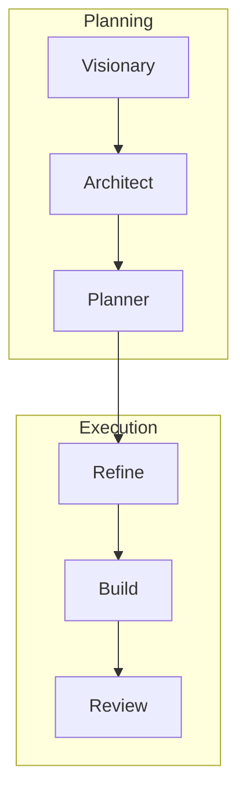

# Agent Workflow

Forge orchestrates work through six phases. Each phase has one or more agents with clear responsibilities. This page describes what each agent does and when you interact with it.

## Flow Overview

**Planning:** Vision → Architecture → Roadmap  
**Execution:** Refine tickets → Implement → Review

---

## Phase 1: Visionary (Product Owner)

**Command:** Runs automatically when you provide a Product Intake Prompt to Architect.

**What it does:** The Visionary maintains product direction. It reads `vision.json` and `project.json`, determines if adjustments are needed based on market input or strategic direction, and hands off to the Architect when technical alignment is required.

**You'll see it when:** You share new market research, user feedback, competitor analysis, or strategic direction. The Visionary updates the vision so downstream agents stay aligned.

**Owns:** `.forge/vision.json`, `.forge/project.json`, `README.md`

---

## Phase 2: Architect

**Command:** `/architect-this {your prompt}`

**What it does:** The Architect performs high-level design. It retrieves the vision, does a clarity check (and loops back to you if more detail is needed), then invokes the right domain subagents to update technical contracts. Finally, it hands off to the Planner with a recap.

**You'll see it when:** You run `/architect-this` with a technical direction, architectural change, or Product Intake Prompt. The Architect delegates to domain experts rather than editing contracts directly.

**Owns:** `.forge/knowledge_map.json` structure; delegates to domain subagents for contract content.

### Domain Subagents (invoked by Architect)

The Architect routes work to these subject-matter experts:

| Subagent | Scope |
|----------|-------|
| **Runtime** | Configuration, startup, lifecycle, execution model |
| **Business Logic** | Domain model, user stories, error handling |
| **Data** | Data model, persistence, serialization, consistency |
| **Interface** | Input handling, presentation, interaction flow |
| **Integration** | API contracts, external systems, messaging |
| **Operations** | Build, deployment, observability, security |

Each subagent owns its `.forge/{domain}/` documents and updates them when the Architect delegates work in that scope.

---

## Phase 3: Planner

**Command:** `/plan-roadmap`

**What it does:** The Planner manages GitHub milestones and issues. It pulls milestones and milestone issues from GitHub, compares them to the vision and knowledge map, and creates or updates milestones and issues. GitHub is the single source of truth—no local roadmap file.

**You'll see it when:** You run `/plan-roadmap` after architecture changes or when you want to sync the roadmap. The Planner defines top-level milestone tickets that Refine will decompose later.

**Owns:** GitHub milestones, dates, project board

---

## Phase 4: Refine

**Command:** `/refine-issue {GitHub issue link}`

**What it does:** The Refine agent turns a Planner ticket into implementation-ready sub-issues. It retrieves the issue from GitHub, creates a parent feature branch from main, consults SME agents for technical guidance, updates the issue with full details (user story, implementation steps, how to test, acceptance criteria), creates sub-issues, and creates a feature branch for each sub-issue from the parent.

**You'll see it when:** You run `/refine-issue` with a GitHub issue link. Refine produces sub-issues that Build can implement directly.

**Outputs:** Sub-issues and feature branches; hands off to Build

---

## Phase 5: Build

**Command:** `/build-from-github` (with a GitHub issue link)

**What it does:** The Build flow implements a refined sub-issue. It retrieves the sub-issue, checks out (or creates) the branch, implements the code changes, runs unit-test, integration-test, and lint-test, scans for security issues, then commits, pushes, and creates a pull request.

**Subagents:**
- **Build Development** — Code changes, validation, security scan
- **Build Wrap** — Commit, push, create PR (uses `.github/pull_request_template.md` if present)

**You'll see it when:** You run `/build-from-github` with a sub-issue link. Build produces a PR ready for Review.

**Outputs:** Pull request; hands off to Review

---

## Phase 6: Review

**Command:** `/review-pr {GitHub PR link}`

**What it does:** The Review flow examines a pull request for correctness and security, then posts review comments. A human performs the merge.

**Subagents:**
- **Review Implementation** — Retrieve PR, checkout branch, review for accuracy
- **Review Security** — Check for vulnerabilities in the changeset
- **Review Wrap** — Add the review to the PR

**You'll see it when:** You run `/review-pr` with a PR link. The Review agents post feedback; you decide when to merge.

**Outputs:** Review comments on PR; human performs merge

---

## Commands Summary

| Command | Phase | Input | Output |
|---------|-------|-------|--------|
| `/architect-this {prompt}` | Architecting | Your prompt | Updated `.forge` documents |
| `/plan-roadmap` | Planning | vision, knowledge map | Synced GitHub milestones/issues |
| `/refine-issue {link}` | Refining | GitHub issue link | Refined sub-issues and branches |
| `/build-from-github` | Building | GitHub issue link | Pull request |
| `/review-pr {link}` | Reviewing | GitHub PR link | PR with review (you merge) |

---

## Chat Participants (VS Code / Cursor)

Type `@` in chat to use Forge personas:

| Participant | Purpose |
|-------------|---------|
| **@forge** | Main Forge helper for guidance |
| **@forge-refine** | Refine GitHub issues |
| **@forge-commit** | Commit with validation |
| **@forge-push** | Safely push to remote |
| **@forge-pullrequest** | Create PR |
| **@forge-setup-issue** | Prepare environment (create-feature-branch) |
| **@forge-build-issue** | Implement via build-from-github |
| **@forge-review-pr** | Review PR and post comments |
