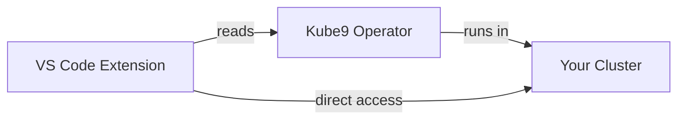

# Kube9 Ecosystem

Kube9 is a comprehensive Kubernetes management platform that combines intelligent automation with developer-first experiences. The ecosystem consists of multiple integrated components that work together seamlessly.

## Components

### 🖥️ VS Code Extension
**Desktop app with embedded AI agent**

The Kube9 VS Code extension provides intelligent Kubernetes cluster management directly within your IDE. Features an embedded AI agent for analysis, troubleshooting, and recommendations.

- **Status:** MVP
- **License:** Open Source & Free
- **Privacy:** All data stays local

[Learn more about the VS Code Extension →](/kube9/vscode)

### ⚙️ Kube9 Operator
**In-cluster validation and monitoring**

The Kube9 Operator runs inside your Kubernetes cluster, performing Well-Architected Framework assessments, event tracking, and security scanning. All features are completely free and open source.

- **Status:** In Development
- **License:** Open Source & Free
- **Privacy:** All data stays in your cluster

[Learn more about the Operator →](/kube9/operator)

---

::: info Looking for a Desktop App?
**Kube9 Desktop** is available as a freemium product for teams who want a native desktop experience with additional enterprise features. [Learn more at alto9.com](https://alto9.com)
:::

## How They Work Together

1. **Operator (Optional):** Runs in your cluster, performs assessments and collects insights
2. **VS Code Extension:** Connects to your cluster directly AND reads operator data if available

## Key Features

- ✅ **Embedded AI Agent** - Local intelligent analysis in VS Code
- ✅ **Well-Architected Framework** - Comprehensive cluster validation
- ✅ **Multi-Cluster Management** - Handle multiple clusters easily
- ✅ **Event Tracking** - Comprehensive cluster event history
- ✅ **100% Privacy** - All data stays local or in your cluster
- ✅ **Open Source** - Completely free with full transparency

## Getting Started

1. **Start with the VS Code Extension** - Works immediately with any cluster
2. **Add the Operator (Optional)** - For enhanced insights and assessments

[Learn more about the VS Code Extension →](/kube9/vscode)

## Links

- [GitHub - VS Code Extension](https://github.com/alto9/kube9-vscode)
- [GitHub - Operator](https://github.com/alto9/kube9-operator)
- [Kube9 Desktop](https://alto9.com) - Freemium desktop application (not open source)

