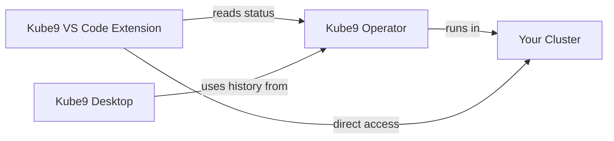

# Kube9 Ecosystem

Kube9 is a comprehensive Kubernetes management platform that combines intelligent automation with developer-first experiences. The ecosystem consists of multiple integrated components that work together seamlessly.

## Components

### 🖥️ VS Code Extension
**Proactive Kubernetes management in your IDE**

The extension ships on the VS Code Marketplace as **Kube9 – Kubernetes Cluster Manager**. It connects to clusters using your kubeconfig, with richer views when the Kube9 Operator is present.

- **Status:** Available on Marketplace (actively maintained — open development on GitHub)
- **License:** Open Source & Free (MIT)
- **Privacy:** Routine cluster data stays local; optional VS Code / marketplace telemetry follows your IDE settings—never manifests, logs, kubeconfig paths, or API bodies in those payloads (see extension README)

[Learn more about the VS Code Extension →](/kube9/vscode)

### ⚙️ Kube9 Operator
**In-cluster validation and monitoring**

The Kube9 Operator runs inside your Kubernetes cluster, performs scheduled Well-Architected Framework validation, persists assessments and events in-cluster, and exposes operator status for connected Kube9 tools. The Helm chart does not configure remote product sign-in or API keys; it is open source and self-contained.

- **Status:** Open source (actively maintained)
- **License:** Open Source & Free
- **Privacy:** Data stays in your cluster; no chart-managed remote registration

[Learn more about the Operator →](/kube9/operator)

### 🤖 Kube9 Desktop
**AI-powered Kubernetes IDE (freemium)**

Kube9 Desktop is a cross-platform Electron application: **Desktop Free** is full cluster-focused IDE tooling; **Desktop Pro** adds an AI agent that can use historical context from kube9-operator. Pro is designed so **hosted inference can be included with your subscription** (no separate LLM provider account required by default); **bring-your-own-provider (BYOK)** remains available when your organization requires it.

- **Status:** Pre-release (shipping roadmap—see product site)
- **License:** Freemium (Free + paid Pro / Enterprise tiers)
- **AI (Pro):** Agent + operator-backed context; hosted inference bundled with subscriptions where offered; BYOK remains optional when you route AI yourself

[Learn more about Kube9 Desktop →](/kube9/desktop)

## How They Work Together

```mermaid
graph LR
    vscode[Kube9 VS Code Extension] -->|reads status| operator[Kube9 Operator]
    operator -->|runs in| cluster[Your Cluster]
    vscode -->|direct access| cluster
    desktop[Kube9 Desktop] -->|uses history from| operator
```

1. **Operator (Optional):** Runs in-cluster and provides validation plus status signaling
2. **VS Code Extension:** Connects directly to Kubernetes and unlocks additional views when operator data is available
3. **Desktop App:** Direct cluster access; Desktop Pro optionally uses operator-backed history for higher-context AI (install operator for that path—see Desktop docs)

## Key Features

- ✅ **Cluster IDE workflows** — Tree navigation, resources, Helm, events, logs, port-forwards, and more in VS Code; Desktop targets the same family of workflows standalone
- ✅ **Well-Architected Framework** - Comprehensive cluster validation
- ✅ **Multi-Cluster Management** - Handle multiple clusters easily
- ✅ **Operator Status Signaling** - Tier and health visibility for connected tools
- ✅ **Privacy-conscious** - Cluster workloads stay in your cluster; the VS Code extension keeps routine cluster data local and limits optional telemetry to non-identifying product events (see extension docs)
- ✅ **Open source core** — VS Code extension and operator are OSS; Desktop is commercial with a Free tier

## Getting Started

1. **Start with the VS Code Extension** - Works immediately with any cluster
2. **Add the Operator (Optional)** - For enhanced assessments and event tracking

[Learn more about the VS Code Extension →](/kube9/vscode)

## Links

- [GitHub - VS Code Extension](https://github.com/alto9/kube9-vscode)
- [GitHub - Operator](https://github.com/alto9/kube9-operator)
- [Kube9 Desktop](https://alto9.com) — Freemium desktop IDE; product and pricing updates on the Alto9 site

