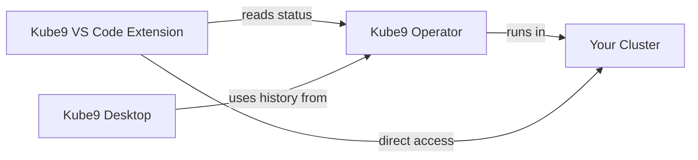

# Kube9 Ecosystem

Kube9 is a comprehensive Kubernetes management platform that combines intelligent automation with developer-first experiences. The ecosystem consists of multiple integrated components that work together seamlessly.

## Components

### 🖥️ VS Code Extension
**Intelligent Kubernetes management in your IDE**

The Kube9 VS Code extension provides intelligent Kubernetes cluster management directly within your IDE. Features context-aware analysis, troubleshooting, and recommendations.

- **Status:** MVP
- **License:** Open Source & Free
- **Privacy:** Routine cluster data stays local; optional VS Code telemetry follows IDE settings (see extension README)

[Learn more about the VS Code Extension →](/kube9/vscode)

### ⚙️ Kube9 Operator
**In-cluster validation and monitoring**

The Kube9 Operator runs inside your Kubernetes cluster, performs scheduled Well-Architected Framework validation, persists assessments and events in-cluster, and exposes operator status for connected Kube9 tools. The Helm chart does not configure remote product sign-in or API keys; it is open source and self-contained.

- **Status:** Open source (actively maintained)
- **License:** Open Source & Free
- **Privacy:** Data stays in your cluster; no chart-managed remote registration

[Learn more about the Operator →](/kube9/operator)

### 🤖 Kube9 Desktop
**AI-powered Kubernetes management**

Kube9 Desktop is a cross-platform desktop application with an AI-powered experience that uses operator-backed cluster history and your preferred AI provider.

- **Status:** In Development
- **License:** Freemium (Free tier + Pro/Enterprise subscriptions)
- **AI Features:** Embedded AI agent with historical context

[Learn more about Kube9 Desktop →](/kube9/desktop)

## How They Work Together

```mermaid
graph LR
    vscode[Kube9 VS Code Extension] -->|reads status| operator[Kube9 Operator]
    operator -->|runs in| cluster[Your Cluster]
    vscode -->|direct access| cluster
    desktop[Kube9 Desktop] -->|uses history from| operator
```

1. **Operator (Optional):** Runs in-cluster and provides validation plus status signaling
2. **VS Code Extension:** Connects directly to Kubernetes and unlocks additional views when operator data is available
3. **Desktop App:** Uses operator-backed history to improve AI-assisted Kubernetes workflows

## Key Features

- ✅ **Context-Aware Analysis** - Intelligent cluster analysis in VS Code
- ✅ **Well-Architected Framework** - Comprehensive cluster validation
- ✅ **Multi-Cluster Management** - Handle multiple clusters easily
- ✅ **Operator Status Signaling** - Tier and health visibility for connected tools
- ✅ **Privacy-conscious** - Cluster workloads stay in your cluster; the VS Code extension keeps routine cluster data local and limits optional telemetry to non-identifying product events (see extension docs)
- ✅ **Open Source** - Completely free with full transparency

## Getting Started

1. **Start with the VS Code Extension** - Works immediately with any cluster
2. **Add the Operator (Optional)** - For enhanced assessments and event tracking

[Learn more about the VS Code Extension →](/kube9/vscode)

## Links

- [GitHub - VS Code Extension](https://github.com/alto9/kube9-vscode)
- [GitHub - Operator](https://github.com/alto9/kube9-operator)
- [Kube9 Desktop](https://alto9.com) - Freemium desktop application with AI agent

